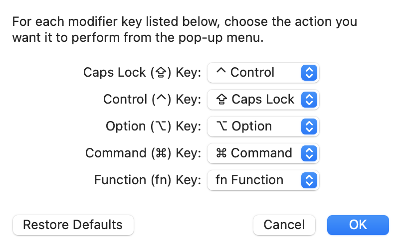

*This post will be like a [webmd](https://www.webmd.com/) post.*

If you're like me and love love love terminal and can't stand GUI and trying to be old-school, you've probably at least heard of [Emacs](https://www.gnu.org/software/emacs/). Even though I don't use Emacs as my primary editor for now (still transitioning), I've used it so long to nearly got emacs pinky.

## Causes
When you're using emacs, you use the Control key a lot. Every shortcut starts with either Control or Meta (Alt/option key by default). On a standard keyboard Control key is placed at the bottom left corner (if you're a Mac user like me, there's fn and Control is placed at the even worse position). The most efficient way to reach it is with your left pinky, and that's understandable, but, as I said, you use Control a lot, and your pinky will hurt after a while, and you may even develop [RSI](https://en.wikipedia.org/wiki/Repetitive_strain_injury).

## Solution
Remap your Control key to Caps Lock.

If you're a Mac user, go to System Settings -> Keyboard and on the first tab "Keyboard" you'll see "Modifier Keys" button and switch Control and Caps Lock keys like this:

If you're a Linux user, I assume that you already know about how awesome the arch wiki is and you're able to find the solution. Here's the [link](https://wiki.archlinux.org/index.php/Xorg/Keyboard_configuration#Swapping_Caps_Lock_with_Left_Control).

If you're a Windows user, give me a call anytime, and I'll install a Linux distro (or BSD) of your choice for free. If you're like far away from me, send me the machine, and I'll return it the next day with better OS! I'll even pay for shipping on both ways.

## Treatment
Get yourself a cold pack on your finger and visit your physician.
