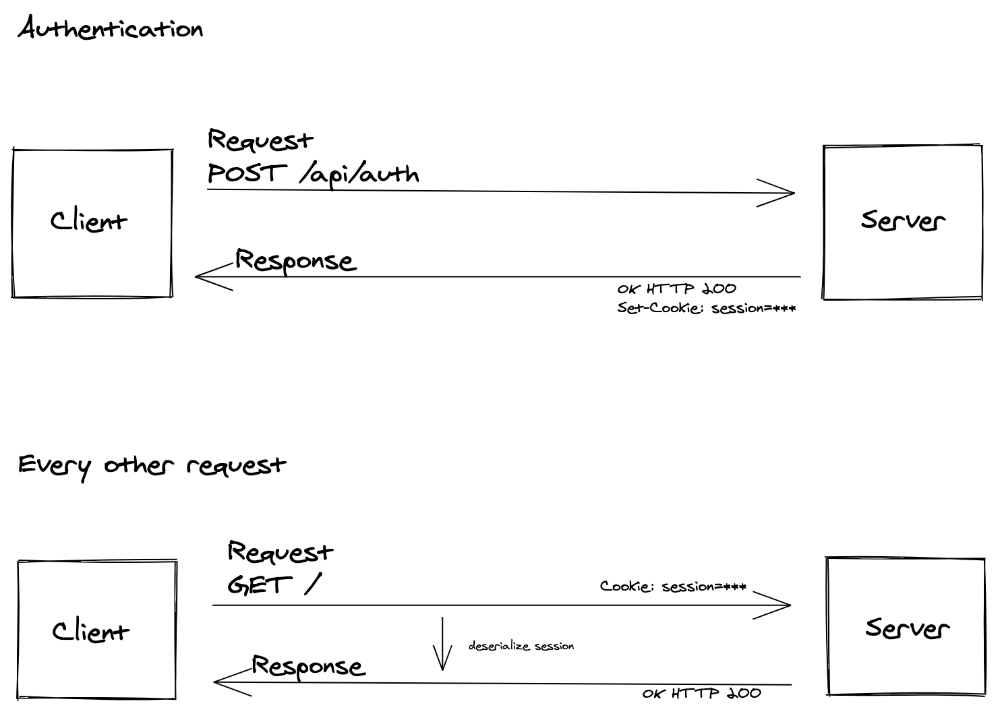
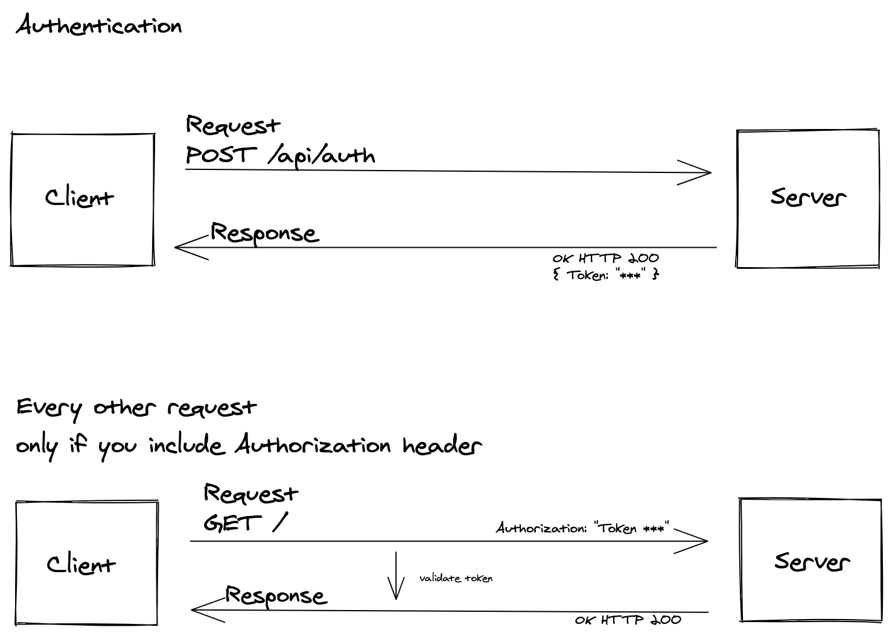

First of all, let's get these things straight.

**Authentication** is the process of proving that you are who you say you are.

**Authorization** is the process of proving that you have the right and the privilege to access the data you're requesting from the server.

## HTTP Cookies
MDN says: An HTTP cookie is a small piece of data that a server sends to the user's web browser. The browser may store it and send it back with later requests to the same server. The cookie is usually stored by the browser, and then the cookie is sent with requests made to the same server inside a Cookie HTTP header.

An HTTP cookie is set by receiving 'Set-Cookie' header with the response from the server. Cookies are sent with every request, so they may worsen the app performance as there may be unneeded cookies sent.

## Traditional Cookie-based Authentication Flow

## Token
Tokens are quite the same, as they also are a small piece of data and are sent as HTTP header. Opposed to Cookies, they can be sent to any domain with any request.

Performance-wise tokens are doing a little better as you have the choice of sending them as you wish. If you need to send it with every request, go for it. If not, just include them when necessary.

## Traditional Token-based Authentication Flow

## Comparison
Cookies work well when it comes to single domains and sub-domains. But when it comes to managing data across the multiple domains, there's where the tokens start to shine.

But, tokens take very much space! When used in the authentication, session cookies are as light as a feather compared to the token.

When it comes to the server-side, with cookie-based authentication, the server needs to verify session-cookie with every request against the database. With token-based authentication, the server only needs to verify if the token is valid, as the tokens self-contain all the data to check it's validity. So, the tokens are a bit faster.
